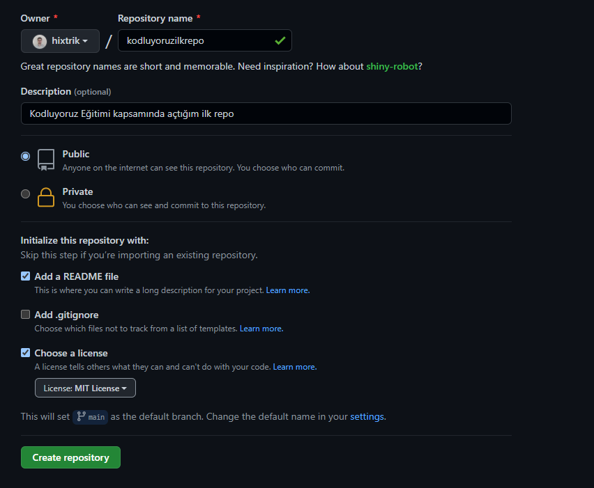

 

# Kodluyoruz Ilk Repo
 Bu repo [Kodluyoruz](https://kodluyoruz.org) Front-End  eğitiminde oluşturdugumuz ilk repo , içerisinde bir adet README dosyası, bir adet index.  html barındırıyor.
 # Installation
 Öncelikle proje clonelandı.  
https://github.com/GulCinarr/kodluyoruzilkRepo.git
# Usage

  Proje Colonlandı Visual Studio Code programında açıldı.  
  Linux için  
  >cd kodluyoruzilkrepo  
  code .
# Contributing 
  >Pull requestler kabul edilir .Büyük değişikliler için önce neyi değiştirmek istediğimiz.  

# Licence 

[MIT]()
